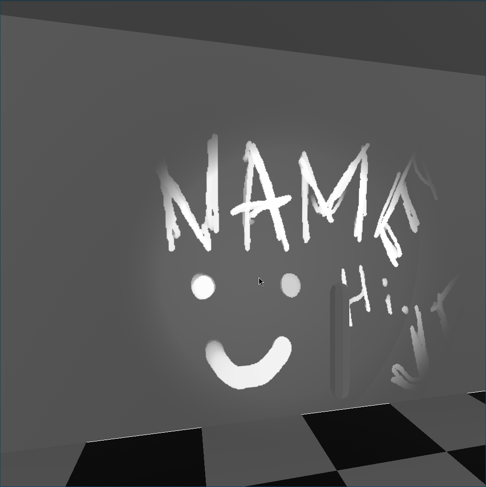

+++
title = "creating a blacklight shader"
date = 2024-11-29
[taxonomies]
projects = ["bevy_blacklight_material"]
+++

today i wanted to take a bit of time to write about a shader i implemented for my in-progress game project (more on that soon™)

i wanted to create a "blacklight" effect, where specific lights could reveal part of the base texture. this shader works with **spot lights** only, but could be extended to work with point lights

;

i wrote this shader in wgsl for a [bevy engine](https://bevyengine.org) project, but it should translate easily to other shading languages

the finished shader can be found as part of [this repo](https://github.com/exvacuum/bevy_blacklight_material)
## shader inputs

for this shader, i wanted the following features:
- the number of lights should be dynamic
- the revealed portion of the object should match the area illuminated by each light
    - the falloff of the light over distance should match the fading of the object

for this to work i need the following information about each light:
- position (world space)
- direction (world space)
- range
- inner and outer angle
    - these will control the falloff of the light at its edges
    - outer angle should be less than pi/2 radians 
    - inner angle should be less than the outer angle

i also need some info from the vertex shader:
- position (**world space!**)
- uv

bevy's default pbr vertex shader provides this information, but as long as you can get this info into your fragment shader you should be good to go

lastly i'll take a base color texture and a sampler

with all of that, i can start off the shader by setting up the inputs and fragment entry point:

```wgsl
#import bevy_pbr::forward_io::VertexOutput;

struct BlackLight {
	position: vec3<f32>,
	direction: vec3<f32>,
	range: f32,
	inner_angle: f32,
	outer_angle: f32,
}

@group(2) @binding(0) var<storage> lights: array<BlackLight>;
@group(2) @binding(1) var base_texture: texture_2d<f32>;
@group(2) @binding(2) var base_sampler: sampler;

@fragment
fn fragment(
	in: VertexOutput,
) -> @location(0) vec4<f32> {
}
```
(bevy uses group 2 for custom shader bindings)

since the number of lights is dynamic, i use a [storage buffer](https://google.github.io/tour-of-wgsl/types/arrays/runtime-sized-arrays/) to store that information

## shader calculations

the first thing we'll need to know is how close to looking at the fragment the light source is

we can get this information using some interesting math:

```wgsl
let light = lights[0];
let light_to_fragment_direction = normalize(in.world_position.xyz - light.position);
let light_to_fragment_angle = acos(dot(light.direction, light_to_fragment_direction));
```

the first step of this is taking the dot product of light direction and the direction from the light to the fragment

since both direction vectors are normalized, the dot product will be between -1.0 and 1.0

the dot product of two unit vectors is the cosine of the angle between them ([proof here](https://math.libretexts.org/Bookshelves/Calculus/Calculus_(OpenStax)/12%3A_Vectors_in_Space/12.03%3A_The_Dot_Product#Evaluating_a_Dot_Product))

therefore, we take the arccosine of that dot product to get the angle between the light and the fragment

once we have this angle we can plug it in to a falloff based on the angle properties of the light:

```wgsl
let angle_inner_factor = light.inner_angle/light.outer_angle;
let angle_factor = linear_falloff_radius(light_to_fragment_angle / light.outer_angle, angle_inner_factor)));
```
```wgsl
fn linear_falloff_radius(factor: f32, radius: f32) -> f32 {
	if factor < radius {
		return 1.0;
	} else {
		return 1.0 - (factor - radius) / (1.0 - radius);
	}
}
```
next, we need to make sure the effect falls off properly over distance

we can do this by getting the distance from the light to the fragment and normalizing it with the range of the light before plugging that into an inverse square falloff

we'll use squared distance to avoid expensive and unnecessary square root operations:

```wgsl
let light_distance_squared = distance_squared(in.world_position.xyz, light.position);
let distance_factor = inverse_falloff_radius(saturate(light_distance_squared / (light.range * light.range)), 0.5);
```
```wgsl
fn distance_squared(a: vec3f, b: vec3f) -> f32 {
	let vec = a - b;
	return dot(vec, vec);
}

fn inverse_falloff(factor: f32) -> f32 {
	return pow(1.0 - factor, 2.0);
}

fn inverse_falloff_radius(factor: f32, radius: f32) -> f32 {
	if factor < radius {
		return 1.0;
	} else {
		return inverse_falloff((factor - radius) / (1.0 - radius));
	}
}
```

now we'll have a float multiplier between 0.0 and 1.0 for our angle and distance to the light

we can get the resulting color by multiplying these with the base color texture:

```wgsl
let base_color = textureSample(base_texture, base_sampler, in.uv);
let final_color = base_color * angle_factor * distance_factor;
```

this works for one light, but we need to refactor it to loop over all the provided blacklights:
```wgsl
@fragment
fn fragment(
	in: VertexOutput,
) -> @location(0) vec4<f32> {
	let base_color = textureSample(base_texture, base_sampler, in.uv);
	var final_color = vec4f(0.0, 0.0, 0.0, 0.0);
	for (var i = u32(0); i < arrayLength(&lights); i = i+1) {
		let light = lights[i];

		let light_to_fragment_direction = normalize(in.world_position.xyz - light.position);
		let light_to_fragment_angle = acos(dot(light.direction, light_to_fragment_direction));
		let angle_inner_factor = light.inner_angle / light.outer_angle;
		let angle_factor = linear_falloff_radius(light_to_fragment_angle / light.outer_angle, angle_inner_factor);

		let light_distance_squared = distance_squared(in.world_position.xyz, light.position);
		let distance_factor = inverse_falloff_radius(saturate(light_distance_squared / (light.range * light.range)), 0.5);

		final_color = saturate(final_color + base_color * angle_factor * distance_factor);
	}
	return final_color;
}
```

and with that, the shader is pretty much complete

you can view the full completed shader code [here](https://github.com/exvacuum/bevy_blacklight_material/blob/master/assets/shaders/blacklight_material.wgsl)

have fun!

