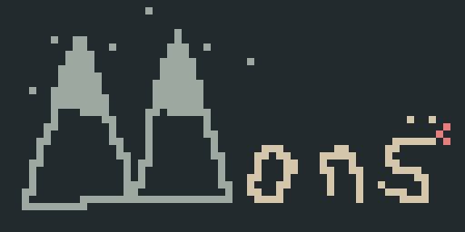
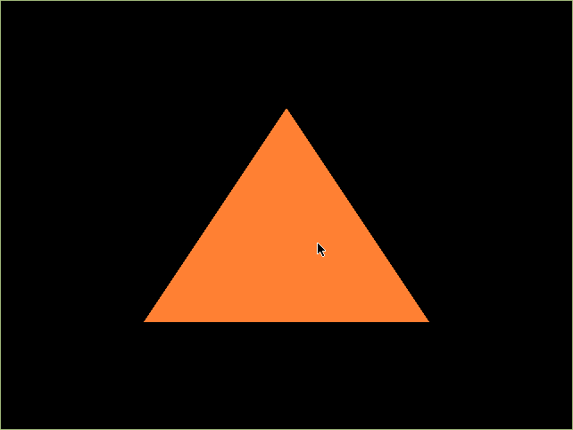
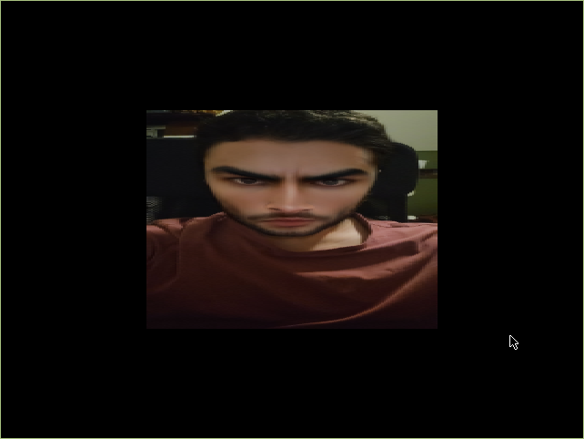
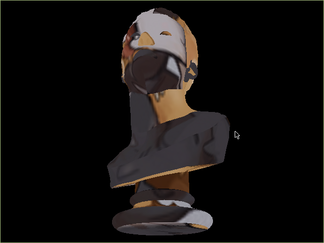
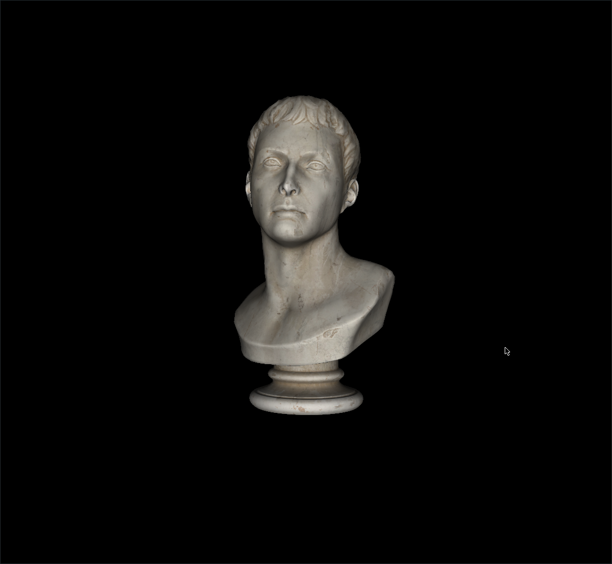
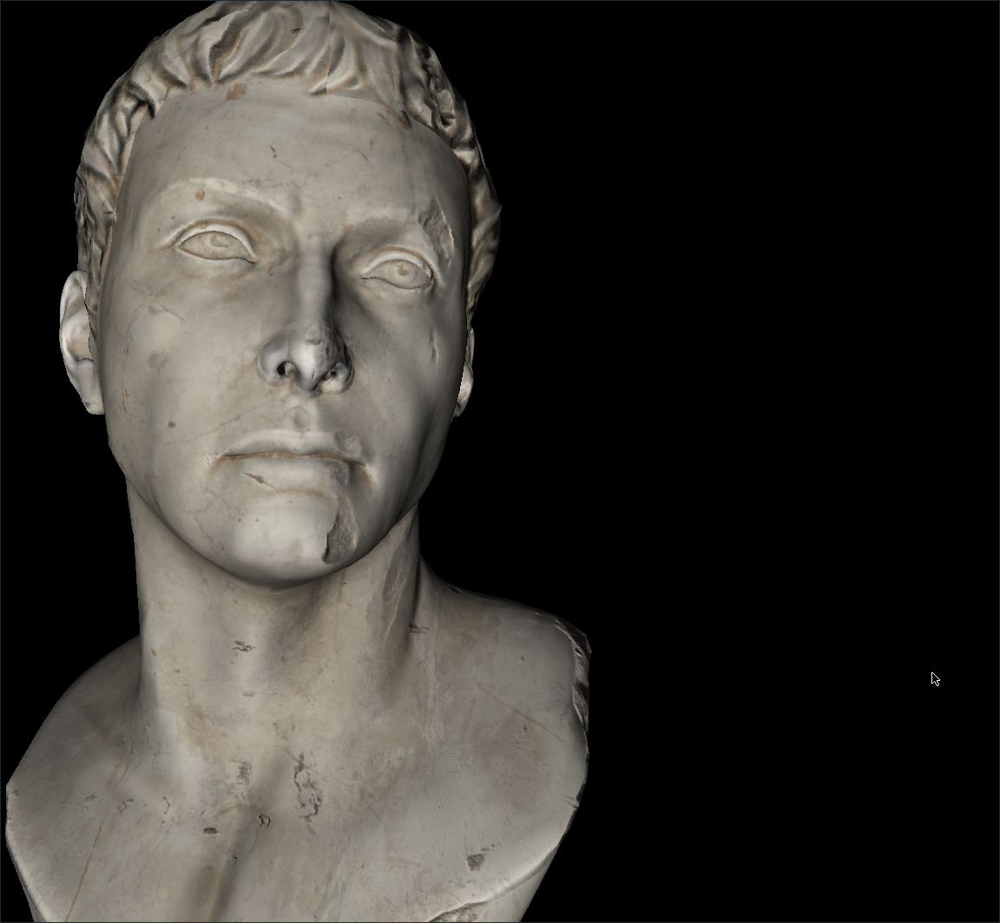

+++
title = "mons (the mountain) - part i: i got sidetracked writing c for a week"
date = 2025-02-06
[extra]
coverimage = "./mons.png"
+++

## the valley

so i've been working for a while on a large game project and was really starting to get burnt out

it's been my primary focus since graduating from school and progress started slowing to a crawl

it was clear to me that i needed a break from the project to recharge a little bit

so i decided to try and start a project i've been fantasizing about for a long time:



mons is a monumental undertaking, an excercise in insanity, and my personal code sanctuary

the goal of the project is pretty abstract, i'm just coding whatever i feel like, but doing it with

## a couple rules

### rule 1: c99

no rust :(

i've been writing rust almost every day for the last 3 years, it's time to get scary

c is like dead simple which is why i think it will be a pretty meditative experience

by meditative i mean mind-numbingly tedious but i'm not in a rush here

i think the absolute worst part of this is the lack of namespaces but i'll live

### rule 2: extremely limited dependencies

it's time to get real

if i'm undertaking this journey in ~~masochism~~ voluntary discomfort (only true stoic sigmas get this one) i might as well be learning something while i do it

this would be "no dependencies" but like i kind of want to make some fun stuff at some point

so i have 3 big exceptions

i can use stdlib and posix shit (at my discretion)

i can use "important" libraries

i don't really have a good description for what makes a library "important" but think hardware stuff like opengl/vulkan or xlib

the last thing is that i can use freely available implementations of algorithms i have no chance in hell of understanding, like [mikktspace](http://www.mikktspace.com/)

i just don't see much value in doing that myself

## the foot

### mons_math

starting out from nothing i decided my first goal would be to spin up a basic 3d graphical application

i decided to start with opengl, i have experience with both it and vulkan and opengl is significantly less work to get started with

before i could even render a basic triangle though, i needed (wanted) a way to represent and manipulate basic linear algebra types such as vectors, matrices, and quaternions

so on the first day i just sat on my couch and typed up a library for exactly that

```
mons_math/src/
├── mat2.c
├── mat3.c
├── mat4.c
├── quat.c
├── util.c
├── vec2.c
├── vec3.c
└── vec4.c
```
(i won't get into implementation details too much in this post in the interest of brevity, but all the code is available on my [git server](https://git.exvacuum.dev/mons/))

i found writing the matrix and vector operations super satisfying in spite of the repetition for different dimensionalities

i do wish i had kept in mind that opengl is column-major for matrices, since i wrote mine as row-major like a normal person, but it might honestly be for the best, as it makes using them much more intuitive based on the stuff i learned in math class

once i had this library i was quickly able to spin up a basic 3d app using opengl, along with xlib and glx for windowing and input under x11



i had always used [glfw](https://www.glfw.org/) for windowing so it was interesting to see how similar it was using xlib (although there were some tricky differences, like windows being created without a depth buffer by default)

### auto-embedding shader files

i set up my project to automatically embed shaders in my code which was pretty cool

basically there isn't a c mechanism similar to rust's lovely [`include_bytes`](https://doc.rust-lang.org/std/macro.include_bytes.html) macro, so the best you can really do is generate a constant byte array and store it in a header file

luckily i learned how to use the [xxd](https://linux.die.net/man/1/xxd) tool to automatically generate such a header file, and then added a script to automatically embed all files located in my project's `embed` folder and place generated headers in the corresponding `include/embedded` location

```
embed/
└── shaders
    ├── basic.frag.glsl
    └── basic.vert.glsl
include/
├── ...
├── embedded
│   └── shaders
│       ├── basic.frag.glsl.h
│       └── basic.vert.glsl.h
└── ...
```

then i added it as a fake target in my cmake project and made the main project target depend on it

### mons_qoi

not satisfied with a simple solid color, i decided i needed to load images

obviously i wasn't allowed to use an existing loader like [stbi](https://github.com/nothings/stb/blob/master/stb_image.h)

i did take a quick look at the png and jpeg specifications since these are by far and away the most popular texture image formats out there

my lazy ass was not about to write a loader for either of those formats (for now)

for now i decided to look for something easy to implement but like actually respectable (so not [ppm](https://netpbm.sourceforge.net/doc/ppm.html)), and boy oh boy

enter [qoi](https://qoiformat.org/)

this shit descended from the heavens i swear to god

qoi, or the quite ok image format, is extremely simple and extremely fast to encode and decode, and offers pretty decent lossless compression

my decoder is around 200 lines of c i think, which is a bit more than the [reference implementation](https://github.com/phoboslab/qoi) i believe but i tried my best to not refer to it for fun

once i had that i was able to just pop the loaded image data into opengl textures



### mons_json

up to this point i was using hardcoded vertex buffers and i wanted to be able to load more complex geometry

i considered using [obj](https://www.loc.gov/preservation/digital/formats/fdd/fdd000507.shtml) for my models but i'm a big fan of [gltf](https://www.khronos.org/Gltf) so i decided to just jump the gun and go for a gltf loader right off the bat

gltf is stored as [json](https://www.json.org/json-en.html) data so i knew if i wanted to have a shot i would need a flexible, dynamic json solution

```c
struct mons_json_value;
union mons_json_entry;

typedef struct mons_json_array {
    struct mons_json_value *values;
    unsigned int len;
} mons_json_array;

typedef union mons_json_value_data {
    char *string;
    float number;
    mons_hashmap object;
    mons_json_array array;
    bool boolean;
    void *null;
} mons_json_value_data;

typedef enum mons_json_value_type {
    MONS_JSON_STRING,
    MONS_JSON_NUMBER,
    MONS_JSON_OBJECT,
    MONS_JSON_ARRAY,
    MONS_JSON_BOOL,
    MONS_JSON_NULL,
} mons_json_value_type;

typedef struct mons_json_value {
    mons_json_value_type type;
    mons_json_value_data data;
} mons_json_value;
```

i discovered a cool pattern here where a combination of an enum and a union (never actually used one before this project) allowed me to store a variety of types in a `mons_json_value` while being aware of which type it actually was

### mons_hashmap

the performance of my json structures depended on my ability to store key-value pairs in an efficient-to-access way

obvious choice was a hashmap data structure

i just implemented this from memory from my data structures class back in school

```c
typedef struct mons_hashmap_pair {
    char *key;
    void *value;
    struct mons_hashmap_pair *next;
} mons_hashmap_pair;

typedef struct mons_hashmap {
    mons_hashmap_pair **data;
    unsigned int bucket_count;
    unsigned int member_size;
    unsigned int len;
} mons_hashmap;
```

this hashmap is basically just an array of linked lists that pairs get shoved into based on the hash of the key

for the hash function i just went with the [djb2 hash function](http://www.cse.yorku.ca/~oz/hash.html) since it worked well for me in the past

### mons_gltf

at long last, i was able to dig into the gltf format

[the specification](https://registry.khronos.org/glTF/specs/2.0/glTF-2.0.html) is quite deep and i focused on implementing basic mesh features first, opting to do things like animations, morph targets, scenes, node hierarchies, etc. later

i actually found the process of implementing the loader pretty chill, i especially enjoyed learning how the data was stored in the binary buffers and how to use accessors to read it

after about a day of work i managed to get mesh primitives out of the gltf files and into my in-memory model structure



(i was using [this model](https://polyhaven.com/a/marble_bust_01) for testing)

the textures that came with the model were in jpeg format, which i obviously could not yet load, and the gltf spec doesn't support formats other than jpeg and png

so i said "To hell with the spec!" and switched the image mimetypes to the (illegal) `image/qoi` and converted the textures using [imagemagick](https://imagemagick.org/index.php) anyway

then my textures loaded beautifully



at this point i was getting pretty tired lol

i was ready to take a break from my break

but i wanted to leave off in a really satisfying place so i decided to implement normal mapping as one last thing

as i previously mentioned i would use the [mikktspace](http://www.mikktspace.com) algorithm to do my tangent calculations



and with that i decided i was ready to go back and get some work done on something actually important to me

this whole process took me about a week and was a pretty chill experience

thanks for reading this far, i hope it's not too brutal

\- silas
