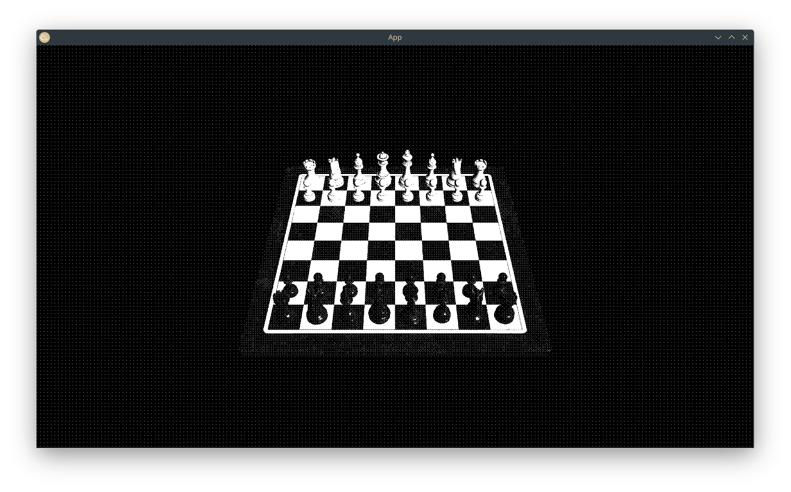
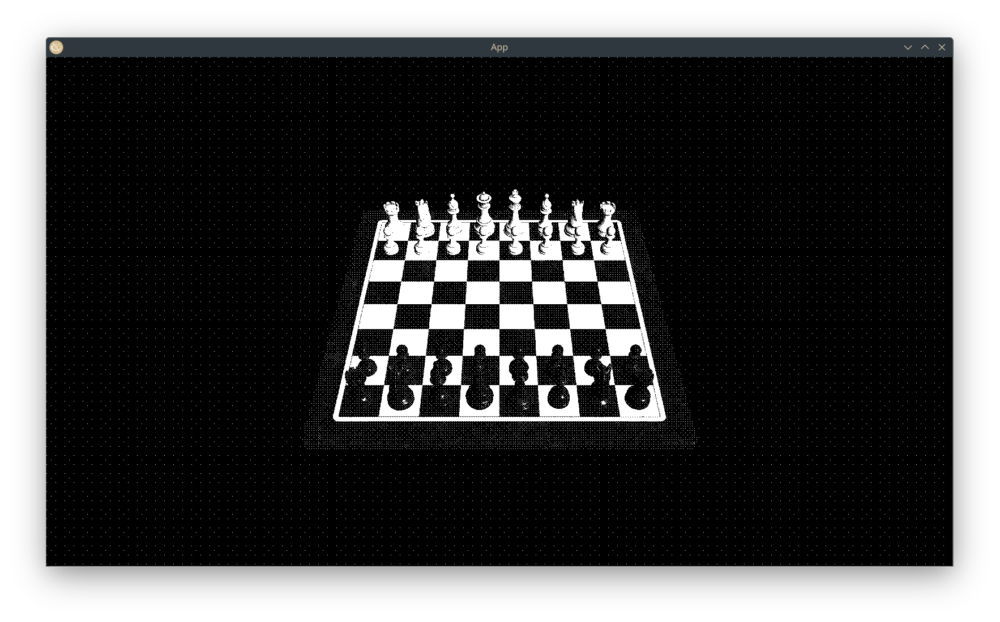

+++
title = "bevy_dither_post_process"
[taxonomies]
categories = ["bevy plugin"]
languages = ["rust", "wgsl"]
[extra]
github = ["exvacuum/bevy_dither_post_process"]
crates = ["bevy_dither_post_process"]
+++

this plugin allows you to add a "monochromatic ordered dithering" post-processing effect to cameras in your bevy engine application

the dithering is monochromatic (black & white) and ordered (using the bayer method) (i'm gonna write a blog post about this soon)

it can be configured with the "level" of dithering to perform (i.e. the size of the bayer matrix to use, where level *n* results in a matrix of size *2^(n+1)*)

i wrote this plugin to enhance the performance of my ongoing game project

originally i did all the dithering on the CPU, and while it was not a huge performance drain due to the screen size being relatively small in the terminal, i figured it would be a good idea to convert it into a shader to take advantage of the GPU and parallelism

since i was using ordered dithering anyways it was pretty easy to port over, since that kind of dithering is super parallelizable on account of not needing to know anything about any other fragment on the screen unlike some methods that provide superior visual quality

the reason i chose ordered dithering though was that other methods produced too much "jitter" when applied to moving objects which was pretty disorienting

