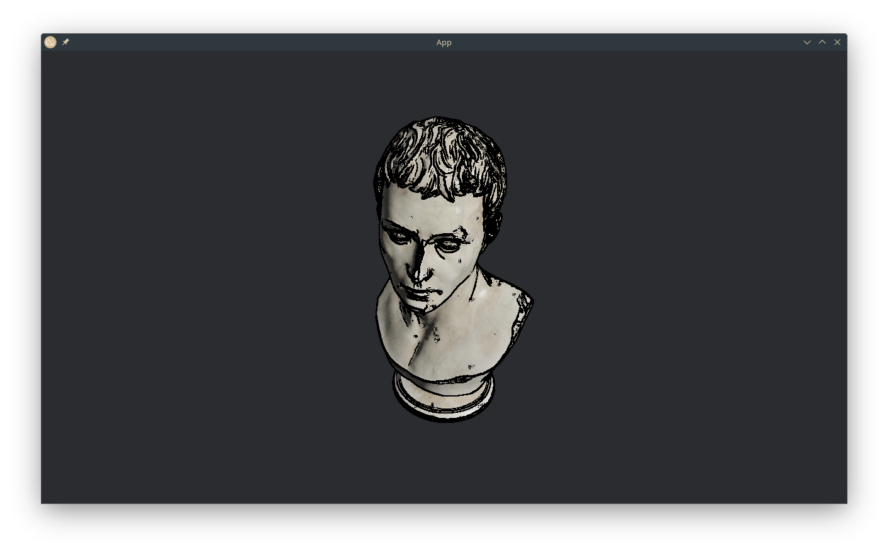
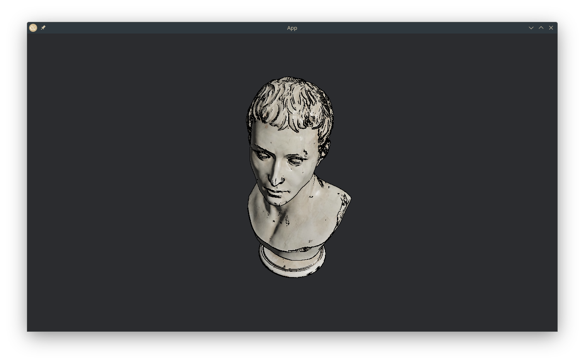
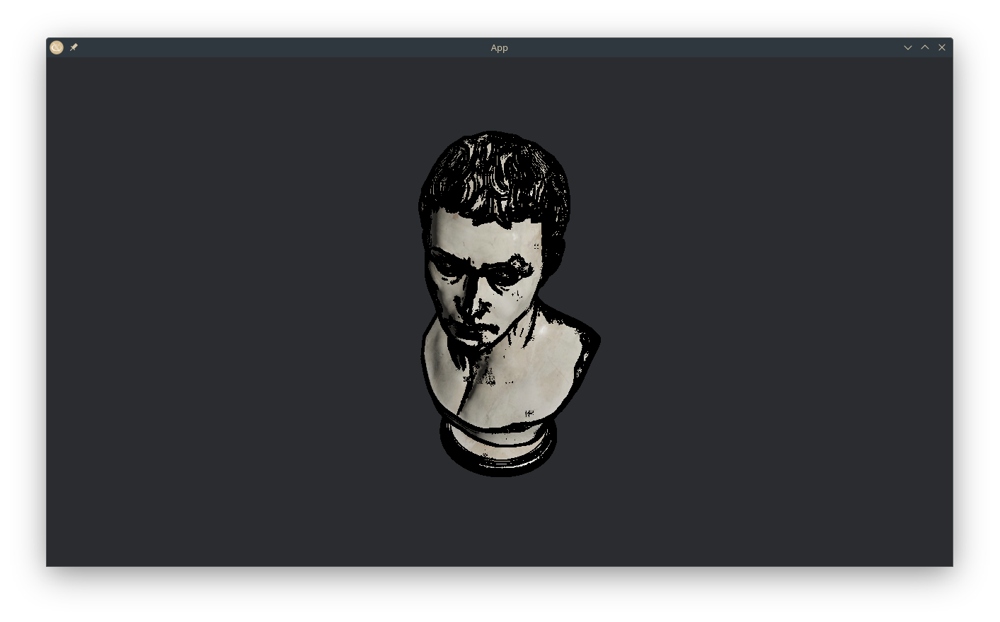
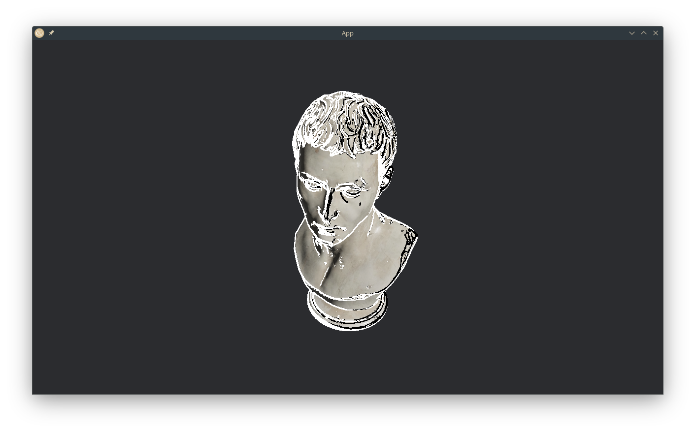

+++
title = "bevy_outline_post_process"
[taxonomies]
categories = ["bevy plugin"]
languages = ["rust", "wgsl"]
[extra]
github = ["exvacuum/bevy_outline_post_process"]
crates = ["bevy_outline_post_process"]
+++

this plugin allows you to add outlines to a camera as a post-processing effect in the bevy engine

the effect makes use of a normal prepass to determine surface normals of objects in view, and then uses the differences between those normal values to determine where outlines should occur

the effect is configurable, you can change the thickness of the outlines and the threshold (how significant the difference between normals need to be for an outline to appear)

there's also an option to enable *adaptive outlines*, so that darker areas get outlined with white and brighter areas are outlined with black

i created this effect to improve visual contrast in my game project, which is why i haven't added support for different colors

you're free to add it yourself though, probably wouldn't be too hard
