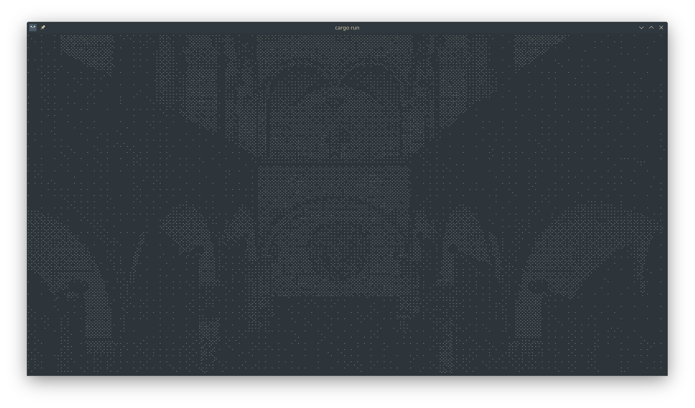
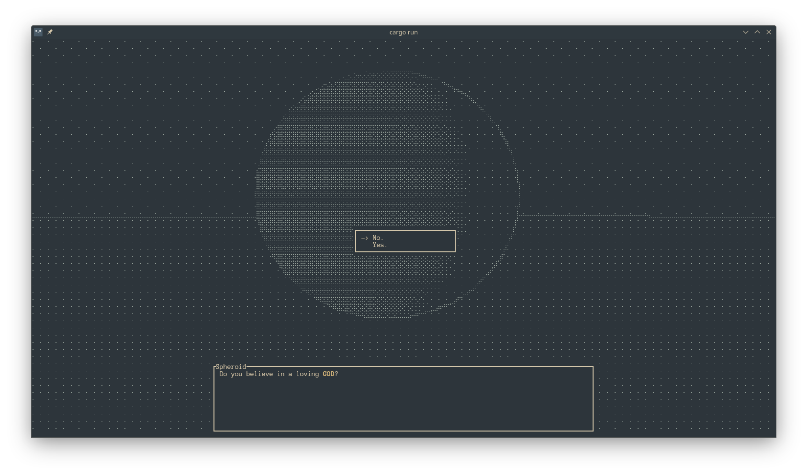

+++
title = "bevy_terminal_display"
[taxonomies]
categories = ["bevy plugin"]
languages = ["rust"]
[extra]
very_cool = true
github = ["exvacuum/bevy_terminal_display"]
crates = ["bevy_terminal_display"]
+++

this plugin allows you to render from a camera to the terminal using [unicode braille characters](https://en.wikipedia.org/wiki/Braille_Patterns)

it makes use of the [bevy_headless_render](@/projects/bevy_headless_render/index.md) plugin for headless rendering, and then uses the [bevy_dither_post_process](@/projects/bevy_dither_post_process/index.md) plugin to dither the captured frame before converting the black and white pixels into the appropriate characters and printing them to the terminal

this plugin uses the [ratatui](https://crates.io/crates/ratatui) and [crossterm](https://crates.io/crates/crossterm) for rendering to the terminal

this plugin manages a `TerminalInput` resource which keeps track of pressed keys

this plugin also has facilities for creating and rendering ratatui widgets

here's an example of a dialog box and option selection widget i've implemented in my [white (I)](@/projects/white_I/index.md) project

in that project, i also make use of the [bevy_outline_post_process](@/projects/bevy_outline_post_process/index.md) for additional visual contrast
